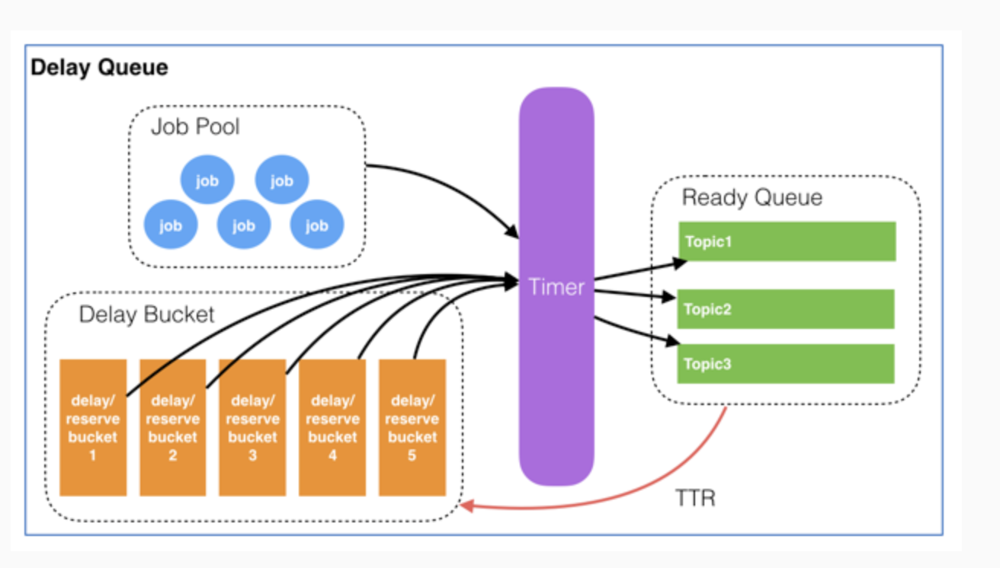

# js-schedule 相关

### 方式一：

一个基础简单的任务队列：

使用rpush、blpop实现任务队列。

使用zrange、zrem实现延时队列。

### 方式二：

https://tech.youzan.com/queuing_delay/

##### 整个延迟队列由4个部分组成：

- Job Pool用来存放所有Job的元信息。
- Delay Bucket是一组以时间为维度的有序队列，用来存放所有需要延迟的／已经被reserve的Job（这里只存放Job Id）。
- Timer负责实时扫描各个Bucket，并将delay时间大于等于当前时间的Job放入到对应的Ready Queue。
- Ready Queue存放处于Ready状态的Job（这里只存放Job Id），以供消费程序消费。

##### 消息结构

每个Job必须包含一下几个属性：

- Topic：Job类型。可以理解成具体的业务名称。
- Id：Job的唯一标识。用来检索和删除指定的Job信息。
- Delay：Job需要延迟的时间。单位：秒。（服务端会将其转换为绝对时间）
- TTR（time-to-run)：Job执行超时时间。单位：秒。
- Body：Job的内容，供消费者做具体的业务处理，以json格式存储。